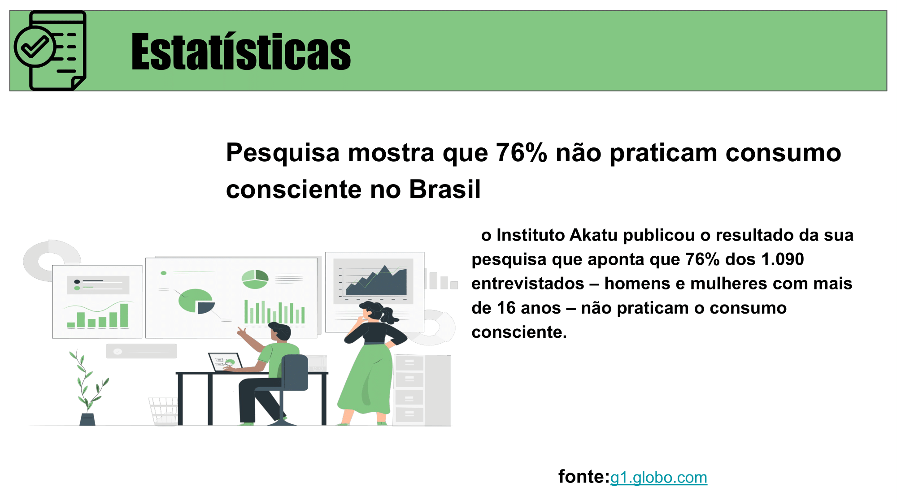
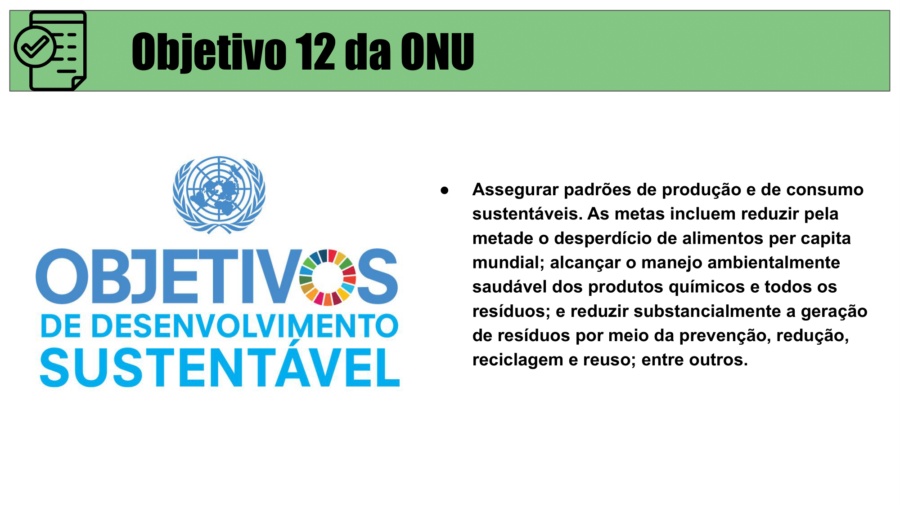
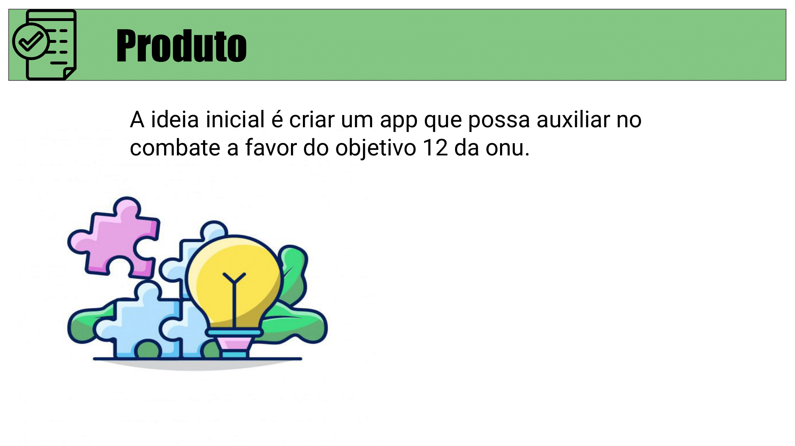
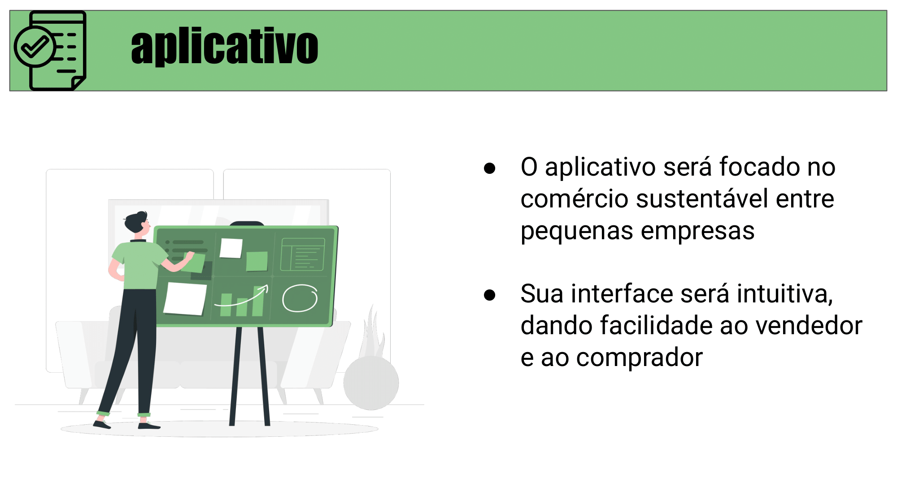
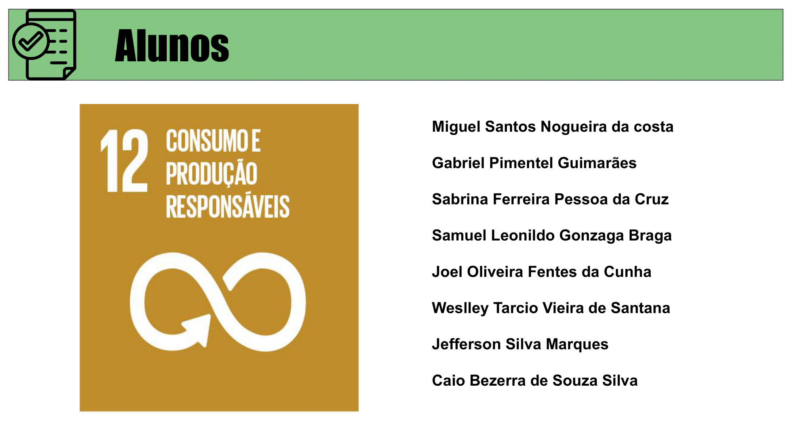
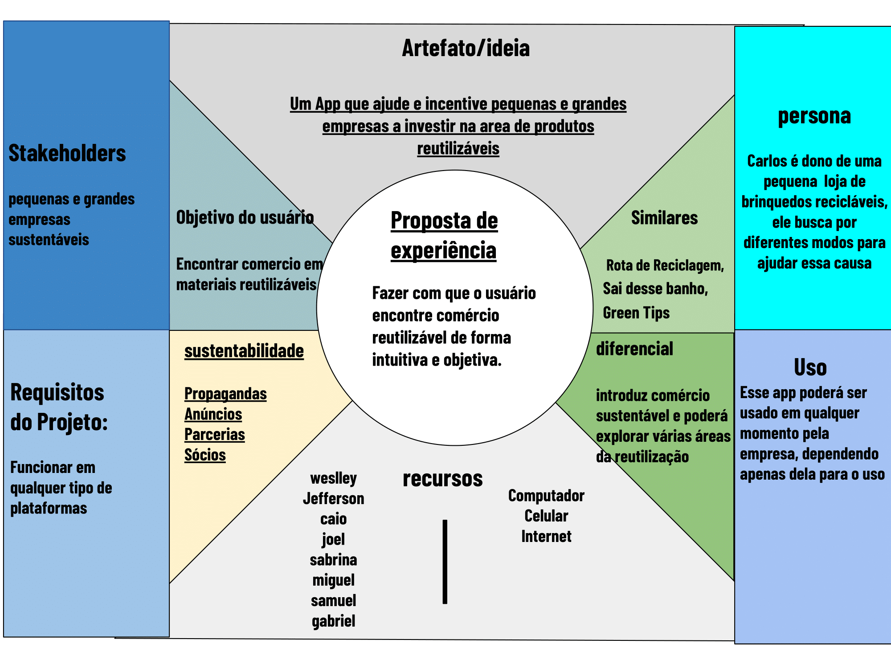
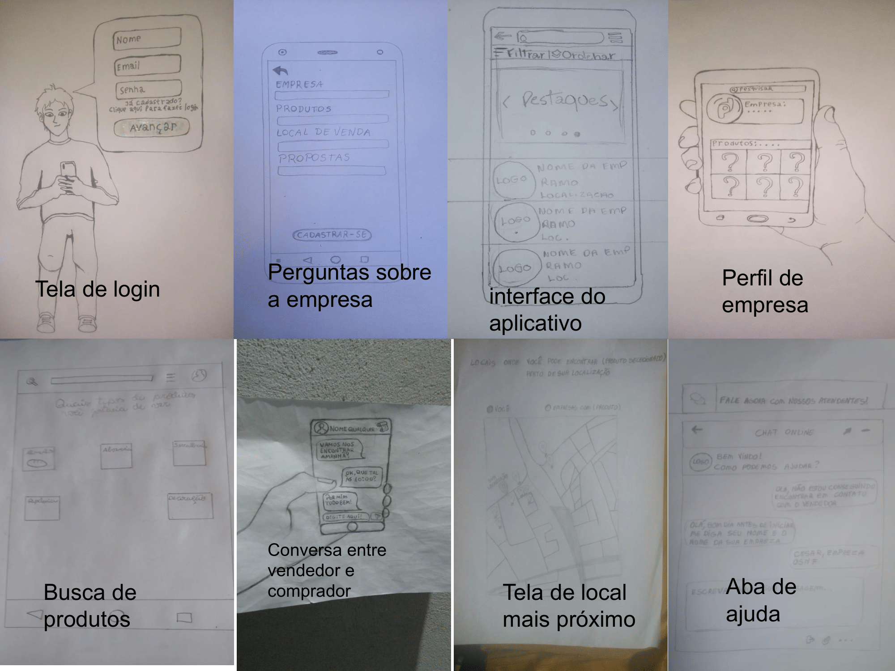

# ReProduct
Reproduct é um protótipo de App desenvolvido pela nossa Equipe de P.I, feito pensando nos pequenos e médios negócios, o ReProduct oferece um serviço de integração entre empresas, para conectar possíveis fornecedores de matéria prima, e possíveis compradores para que elas formem parcerias, evitando o desperdício de matéria utilizável.

